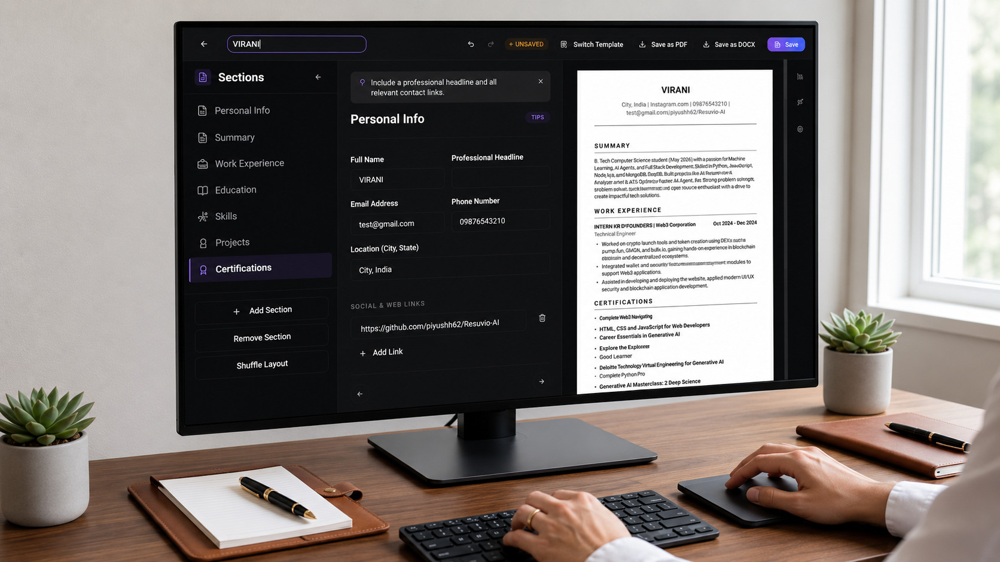

<div align="center">

# ✨ Resuvio-AI ✨

[](https://opensource.org/licenses/MIT)


<br/>

English

</div>

Resuvio-AI is a modern, comprehensive open-source AI career assistant that makes creating professional resumes simple and highly effective. Built with React, Vite, and Google Gemini AI, it supports ATS-optimized resume building, intelligent job matching, and real-time AI cover letter generation.

## 📸 Screenshots



## ✨ Features

- 🚀 Built with React, Vite & Tailwind CSS
- 🧠 AI-Powered Resume Analysis & Scoring (Gemini 2.5)
- 📄 PDF/DOCX Upload & Parsing
- 🎯 Intelligent Job Matching & Skill Gap Analysis
- ✍️ Instant Cover Letter Generation
- 🎨 Custom ATS-Friendly Resume Builder
- 🌙 Dark Mode Support
- 💳 Built-in Credits System via Razorpay
- 🔒 Secure Authentication (Firebase)

## 🛠️ Tech Stack

- **Frontend**: React 18, Vite, TypeScript, Tailwind CSS, shadcn/ui
- **Backend**: Node.js, Express 5.x, TypeScript
- **AI Engine**: Google Generative AI API (Gemini 2.5 Flash)
- **Database & Auth**: Firebase Firestore & Admin SDK
- **Payments**: Razorpay

## 🚀 Quick Start

1. Clone the project

```bash
git clone https://github.com/piyushh62/Resuvio-AI.git
cd Resuvio-AI
```

2. Setup Environment Variables

**Frontend (`frontend/.env`)**
```env
VITE_FIREBASE_API_KEY="your_api_key"
VITE_FIREBASE_AUTH_DOMAIN="your_auth_domain"
VITE_FIREBASE_PROJECT_ID="your_project_id"
VITE_FIREBASE_STORAGE_BUCKET="your_storage_bucket"
VITE_FIREBASE_MESSAGING_SENDER_ID="your_sender_id"
VITE_FIREBASE_APP_ID="your_app_id"
VITE_API_BASE_URL="http://localhost:3001"
```

**Backend (`backend/.env`)**
```env
PORT=3001
FRONTEND_URL="http://localhost:8080"
GEMINI_API_KEY="your_gemini_api_key"
GEMINI_MODEL="gemini-2.5-flash"
# FIREBASE_SERVICE_ACCOUNT_BASE64="your_base64_encoded_json"
```

3. Install dependencies & Start Backend

```bash
cd backend
npm install
npm run dev
```

4. Install dependencies & Start Frontend

```bash
cd ../frontend
npm install
npm run dev
```

5. Open browser and visit `http://localhost:8080`

## 📦 Build and Deploy

**Frontend Build**
```bash
cd frontend
npm run build
```

**Backend Build**
```bash
cd backend
npm run build
```

## 📝 License

The source code of this project is open-sourced under the **MIT License**.
Please see the [LICENSE](LICENSE) file for detailed terms.

## 🗺️ Roadmap

- [x] AI-assisted Resume Writing
- [x] Cover Letter Generation
- [x] Job Matching Engine
- [ ] Multi-language Support
- [ ] Export to DOCX format
- [ ] More modern resume templates
- [ ] Portfolio / Link-in-bio generation

## 📈 Star History

<a href="https://star-history.com/#piyushh62/Resuvio-AI&Date">
 <picture>
   <source media="(prefers-color-scheme: dark)" srcset="https://api.star-history.com/svg?repos=piyushh62/Resuvio-AI&type=Date&theme=dark" />
   <source media="(prefers-color-scheme: light)" srcset="https://api.star-history.com/svg?repos=piyushh62/Resuvio-AI&type=Date" />
   
 </picture>
</a>

## 📞 Contact

You can reach out for questions or support via:

- Email: piyushsenjaliya1999@gmail.com
- Project Homepage: https://github.com/piyushh62/Resuvio-AI

## 🌟 Support

If you find this project helpful, please give it a star ⭐️

## ❤️ Sponsors

<div align="center">
  <h3>Sponsors</h3>
  <p>If you sponsored this project but are not listed here, please contact us.</p>
  <p>
    <!-- Add sponsors here -->
  </p>
</div>
