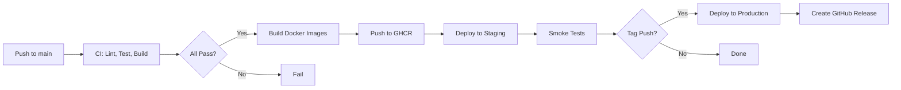

# Deployment Guide

Complete deployment guide for Resuvio-AI across different environments and platforms.

## Table of Contents
- [Overview](#overview)
- [Prerequisites](#prerequisites)
- [Environment Variables](#environment-variables)
- [Frontend Deployment](#frontend-deployment)
- [Backend Deployment](#backend-deployment)
- [Database & Services](#database--services)
- [CI/CD Pipeline](#cicd-pipeline)
- [Monitoring & Logging](#monitoring--logging)
- [Rollback Procedures](#rollback-procedures)
- [Troubleshooting](#troubleshooting)

## Overview

Resuvio-AI consists of two independently deployable services:

| Service | Type | Port | Framework |
|---------|------|------|-----------|
| Frontend | Static SPA | 8080 (dev) / 80/443 (prod) | React + Vite |
| Backend | REST API | 3001 (dev) / 8080 (prod) | Express + TypeScript |

### Deployment Targets

| Environment | Frontend | Backend | Database |
|-------------|----------|---------|----------|
| Development | Vite Dev Server | ts-node-dev | Firebase Emulators |
| Staging | Vercel/Netlify Preview | Cloud Run/Fly.io | Firebase Staging Project |
| Production | Vercel/Netlify | Cloud Run/Fly.io/Render | Firebase Production Project |

## Prerequisites

### Accounts Required
- **GitHub** - Source control & CI/CD
- **Firebase** - Auth, Firestore, Storage
- **Google Cloud** - Gemini AI, Cloud Run (optional)
- **Vercel/Netlify** - Frontend hosting
- **Cloud Run/Fly.io/Render** - Backend hosting
- **Razorpay** - Payments (production)
- **Domain Registrar** - Custom domain

### Tools
```bash
# Install globally
npm install -g firebase-tools vercel netlify-cli

# Or use npx
npx firebase-tools
npx vercel
npx netlify-cli
```

## Environment Variables

### Frontend (Build-time)

These must be set at **build time** (Vite embeds them in the bundle):

```env
# .env.production
VITE_API_BASE_URL=https://resuvio-ai.onrender.com
VITE_FIREBASE_API_KEY=your-production-api-key
VITE_FIREBASE_AUTH_DOMAIN=resuvio-ai.firebaseapp.com
VITE_FIREBASE_PROJECT_ID=resuvio-ai
VITE_FIREBASE_STORAGE_BUCKET=resuvio-ai.appspot.com
VITE_FIREBASE_MESSAGING_SENDER_ID=123456789
VITE_FIREBASE_APP_ID=1:123456789:web:abcdef
```

### Backend (Runtime)

These are read at **runtime** from environment:

```env
# Production
PORT=8080
NODE_ENV=production
FRONTEND_URL=https://resuvio-ai.vercel.app

# Firebase (choose one)
FIREBASE_SERVICE_ACCOUNT_JSON={"type":"service_account","project_id":"resuvio-ai",...}
# OR
GOOGLE_APPLICATION_CREDENTIALS=/path/to/service-account.json
# OR (for Cloud Run)
# Uses default service account with Firebase Admin permissions

# AI
GEMINI_API_KEY=your-production-gemini-key
GEMINI_MODEL=gemini-2.5-flash

# Payments
RAZORPAY_KEY_ID=rzp_live_...
RAZORPAY_KEY_SECRET=...
RAZORPAY_WEBHOOK_SECRET=...

# Optional: Logging
LOG_LEVEL=info
```

### Staging vs Production

| Variable | Staging | Production |
|----------|---------|------------|
| `VITE_API_BASE_URL` | `https://api-staging.resuvio.ai` | `https://resuvio-ai.onrender.com` |
| `FRONTEND_URL` | `https://staging.resuvio.ai` | `https://resuvio-ai.vercel.app` |
| Firebase Project | `resuvio-ai-staging` | `resuvio-ai` |
| Gemini API Key | Test key | Production key |
| Razorpay | Test mode | Live mode |

## Frontend Deployment

### Option 1: Vercel (Recommended)

#### Automatic Deployment
1. Connect GitHub repo to Vercel
2. Configure project:
   - **Framework Preset**: Vite
   - **Root Directory**: `frontend`
   - **Build Command**: `npm run build`
   - **Output Directory**: `dist`
3. Add environment variables in Vercel dashboard
4. Deploy!

#### Manual Deployment
```bash
cd frontend

# Install Vercel CLI
npm install -g vercel

# Login
vercel login

# Deploy to preview
vercel

# Deploy to production
vercel --prod
```

#### Vercel Configuration (`vercel.json`)
```json
{
  "buildCommand": "npm run build",
  "outputDirectory": "dist",
  "devCommand": "npm run dev",
  "installCommand": "npm install",
  "framework": "vite",
  "rewrites": [
    {
      "source": "/(.*)",
      "destination": "/index.html"
    }
  ],
  "headers": [
    {
      "source": "/assets/(.*)",
      "headers": [
        { "key": "Cache-Control", "value": "public, max-age=31536000, immutable" }
      ]
    },
    {
      "source": "/(.*)",
      "headers": [
        { "key": "X-Content-Type-Options", "value": "nosniff" },
        { "key": "X-Frame-Options", "value": "DENY" },
        { "key": "X-XSS-Protection", "value": "1; mode=block" }
      ]
    }
  ]
}
```

### Option 2: Netlify

#### Automatic Deployment
1. Connect GitHub repo to Netlify
2. Configure:
   - **Base Directory**: `frontend`
   - **Build Command**: `npm run build`
   - **Publish Directory**: `dist`
3. Add environment variables
4. Deploy!

#### Netlify Configuration (`netlify.toml`)
```toml
[build]
  base = "frontend"
  command = "npm run build"
  publish = "dist"

[build.environment]
  NODE_VERSION = "20"

[[redirects]]
  from = "/*"
  to = "/index.html"
  status = 200

[[headers]]
  for = "/assets/*"
  [headers.values]
    Cache-Control = "public, max-age=31536000, immutable"

[[headers]]
  for = "/*"
  [headers.values]
    X-Content-Type-Options = "nosniff"
    X-Frame-Options = "DENY"
    X-XSS-Protection = "1; mode=block"
    Referrer-Policy = "strict-origin-when-cross-origin"
```

### Option 3: Docker + Cloud Run

#### Dockerfile (`frontend/Dockerfile`)
```dockerfile
# Build stage
FROM node:20-alpine AS builder
WORKDIR /app
COPY package*.json ./
RUN npm ci
COPY . .
ARG VITE_API_BASE_URL
ARG VITE_FIREBASE_API_KEY
ARG VITE_FIREBASE_AUTH_DOMAIN
ARG VITE_FIREBASE_PROJECT_ID
ARG VITE_FIREBASE_STORAGE_BUCKET
ARG VITE_FIREBASE_MESSAGING_SENDER_ID
ARG VITE_FIREBASE_APP_ID
ENV VITE_API_BASE_URL=$VITE_API_BASE_URL
ENV VITE_FIREBASE_API_KEY=$VITE_FIREBASE_API_KEY
ENV VITE_FIREBASE_AUTH_DOMAIN=$VITE_FIREBASE_AUTH_DOMAIN
ENV VITE_FIREBASE_PROJECT_ID=$VITE_FIREBASE_PROJECT_ID
ENV VITE_FIREBASE_STORAGE_BUCKET=$VITE_FIREBASE_STORAGE_BUCKET
ENV VITE_FIREBASE_MESSAGING_SENDER_ID=$VITE_FIREBASE_MESSAGING_SENDER_ID
ENV VITE_FIREBASE_APP_ID=$VITE_FIREBASE_APP_ID
RUN npm run build

# Production stage
FROM nginx:alpine
COPY --from=builder /app/dist /usr/share/nginx/html
COPY nginx.conf /etc/nginx/conf.d/default.conf
EXPOSE 80
CMD ["nginx", "-g", "daemon off;"]
```

#### Nginx Config (`frontend/nginx.conf`)
```nginx
server {
    listen 80;
    server_name localhost;
    root /usr/share/nginx/html;
    index index.html;

    location / {
        try_files $uri $uri/ /index.html;
    }

    location /assets/ {
        expires 1y;
        add_header Cache-Control "public, immutable";
    }

    gzip on;
    gzip_types text/plain text/css application/json application/javascript text/xml application/xml application/xml+rss text/javascript;
}
```

#### Deploy to Cloud Run
```bash
# Build and push
gcloud builds submit --tag gcr.io/PROJECT_ID/resuvio-frontend \
  --build-arg VITE_API_BASE_URL=https://resuvio-ai.onrender.com \
  --build-arg VITE_FIREBASE_API_KEY=... \
  --region=us-central1

# Deploy
gcloud run deploy resuvio-frontend \
  --image gcr.io/PROJECT_ID/resuvio-frontend \
  --platform managed \
  --region us-central1 \
  --allow-unauthenticated \
  --port 80
```

## Backend Deployment

### Option 1: Google Cloud Run (Recommended)

#### Dockerfile (`backend/Dockerfile`)
```dockerfile
# Build stage
FROM node:20-alpine AS builder
WORKDIR /app
COPY package*.json ./
RUN npm ci
COPY . .
RUN npm run build

# Production stage
FROM node:20-alpine
WORKDIR /app
COPY --from=builder /app/dist ./dist
COPY --from=builder /app/package*.json ./
RUN npm ci --only=production
USER node
EXPOSE 8080
CMD ["node", "dist/server.js"]
```

#### .dockerignore (`backend/.dockerignore`)
```
node_modules
dist
.git
.gitignore
README.md
.env
.env.*
*.log
.DS_Store
coverage
*.test.ts
tests
firebase-debug.log
```

#### Deploy to Cloud Run
```bash
# Build and deploy
gcloud run deploy resuvio-backend \
  --source . \
  --platform managed \
  --region us-central1 \
  --allow-unauthenticated \
  --port 8080 \
  --memory 512Mi \
  --cpu 1 \
  --min-instances 0 \
  --max-instances 10 \
  --set-env-vars NODE_ENV=production,FRONTEND_URL=https://resuvio-ai.vercel.app \
  --set-secrets GEMINI_API_KEY=gemini-api-key:latest,RAZORPAY_KEY_SECRET=razorpay-secret:latest
```

#### Cloud Run Service Account Permissions
```bash
# Grant Firebase Admin permissions
gcloud projects add-iam-policy-binding PROJECT_ID \
  --member="serviceAccount:SERVICE_ACCOUNT@PROJECT_ID.iam.gserviceaccount.com" \
  --role="roles/datastore.user"

# Grant Secret Manager access
gcloud projects add-iam-policy-binding PROJECT_ID \
  --member="serviceAccount:SERVICE_ACCOUNT@PROJECT_ID.iam.gserviceaccount.com" \
  --role="roles/secretmanager.secretAccessor"
```

### Option 2: Fly.io

#### fly.toml (`backend/fly.toml`)
```toml
app = "resuvio-backend"
primary_region = "iad"

[build]
  dockerfile = "Dockerfile"

[env]
  NODE_ENV = "production"
  PORT = "8080"

[http_service]
  internal_port = 8080
  force_https = true
  auto_stop_machines = true
  auto_start_machines = true
  min_machines_running = 0

[[vm]]
  memory = "512mb"
  cpu_kind = "shared"
  cpus = 1
```

#### Deploy
```bash
flyctl launch --no-deploy
flyctl secrets set GEMINI_API_KEY=... RAZORPAY_KEY_SECRET=... FIREBASE_SERVICE_ACCOUNT_JSON=...
flyctl deploy
```

### Option 3: Render

#### render.yaml (`backend/render.yaml`)
```yaml
services:
  - type: web
    name: resuvio-backend
    runtime: node
    plan: starter
    buildCommand: npm ci && npm run build
    startCommand: node dist/server.js
    envVars:
      - key: NODE_ENV
        value: production
      - key: PORT
        value: 8080
      - key: FRONTEND_URL
        value: https://resuvio-ai.vercel.app
      - key: GEMINI_API_KEY
        sync: false
      - key: FIREBASE_SERVICE_ACCOUNT_JSON
        sync: false
      - key: RAZORPAY_KEY_SECRET
        sync: false
    healthCheckPath: /api/health
    autoDeploy: true
```

### Option 4: Traditional VPS (PM2)

```bash
# On server
cd /opt/resuvio-backend
git pull origin main
npm ci
npm run build

# PM2 ecosystem
cat > ecosystem.config.js << 'EOF'
module.exports = {
  apps: [{
    name: 'resuvio-backend',
    script: 'dist/server.js',
    instances: 'max',
    exec_mode: 'cluster',
    env: {
      NODE_ENV: 'production',
      PORT: 3001,
      FRONTEND_URL: 'https://resuvio-ai.vercel.app'
    },
    env_production: {
      GEMINI_API_KEY: '...',
      FIREBASE_SERVICE_ACCOUNT_JSON: '...'
    }
  }]
};
EOF

pm2 start ecosystem.config.js --env production
pm2 save
pm2 startup
```

## Database & Services

### Firebase Setup

#### Production Project
1. Create Firebase project: `resuvio-ai`
2. Enable Authentication (Email/Password, Google)
3. Create Firestore database (Native mode)
4. Set up Firebase Storage
5. Configure authorized domains
6. Create service account for backend

#### Firestore Security Rules
```javascript
// firestore.rules
rules_version = '2';
service cloud.firestore {
  match /databases/{database}/documents {
    // Users can only access their own data
    match /users/{userId} {
      allow read, write: if request.auth != null && request.auth.uid == userId;
    }
    
    match /resumes/{resumeId} {
      allow read, write: if request.auth != null && request.auth.uid == resource.data.userId;
      allow create: if request.auth != null && request.auth.uid == request.resource.data.userId;
    }
    
    match /generatedResumes/{resumeId} {
      allow read, write: if request.auth != null && request.auth.uid == resource.data.userId;
    }
    
    match /coverLetters/{letterId} {
      allow read, write: if request.auth != null && request.auth.uid == resource.data.userId;
    }
    
    match /activity/{activityId} {
      allow read: if request.auth != null && request.auth.uid == resource.data.userId;
    }
    
    match /credits/{userId} {
      allow read, write: if request.auth != null && request.auth.uid == userId;
    }
    
    // Public read for tips
    match /tips/{tipId} {
      allow read: if true;
    }
  }
}
```

#### Deploy Rules
```bash
firebase deploy --only firestore:rules --project resuvio-ai
```

#### Firestore Indexes
```json
// firestore.indexes.json
{
  "indexes": [
    {
      "collectionGroup": "resumes",
      "queryScope": "COLLECTION",
      "fields": [
        { "fieldPath": "userId", "order": "ASCENDING" },
        { "fieldPath": "createdAt", "order": "DESCENDING" }
      ]
    },
    {
      "collectionGroup": "generatedResumes",
      "queryScope": "COLLECTION",
      "fields": [
        { "fieldPath": "userId", "order": "ASCENDING" },
        { "fieldPath": "updatedAt", "order": "DESCENDING" }
      ]
    }
  ]
}
```

### Firebase Storage CORS
```json
// cors.json
[
  {
    "origin": ["https://resuvio-ai.vercel.app", "https://staging.resuvio.ai"],
    "method": ["GET", "POST", "PUT", "DELETE"],
    "responseHeader": ["Content-Type", "Authorization"],
    "maxAgeSeconds": 3600
  }
]
```

```bash
gsutil cors set cors.json gs://resuvio-ai.appspot.com
```

## CI/CD Pipeline

### GitHub Actions Workflows

The repository includes production-ready workflows:

| Workflow | Trigger | Purpose |
|----------|---------|---------|
| `ci.yml` | Push/PR to main/develop | Full test suite |
| `lint.yml` | Push/PR | Code quality checks |
| `deploy.yml` | Push to main / tags | Build & deploy |
| `release.yml` | Git tags (v*) | Create releases |

### Required Secrets

Add these in GitHub Settings → Secrets → Actions:

#### Repository Secrets
```
VITE_API_BASE_URL
VITE_FIREBASE_API_KEY
VITE_FIREBASE_AUTH_DOMAIN
VITE_FIREBASE_PROJECT_ID
VITE_FIREBASE_STORAGE_BUCKET
VITE_FIREBASE_MESSAGING_SENDER_ID
VITE_FIREBASE_APP_ID
GEMINI_API_KEY
RAZORPAY_KEY_ID
RAZORPAY_KEY_SECRET
RAZORPAY_WEBHOOK_SECRET
FIREBASE_SERVICE_ACCOUNT_JSON (or BASE64)
```

#### Environment Secrets (for staging/production environments)
```
# Staging environment
STAGING_FRONTEND_URL
STAGING_API_URL
STAGING_FIREBASE_PROJECT_ID

# Production environment
PRODUCTION_FRONTEND_URL
PRODUCTION_API_URL
PRODUCTION_FIREBASE_PROJECT_ID
```

### Deployment Flow



## Monitoring & Logging

### Health Checks

#### Backend Health Endpoint
```typescript
// Add to server.ts
app.get('/api/health', (req, res) => {
  res.json({
    status: 'healthy',
    timestamp: new Date().toISOString(),
    uptime: process.uptime(),
    version: process.env.npm_package_version,
    environment: process.env.NODE_ENV
  });
});
```

#### Frontend Health Check
```html
<!-- Add to index.html or create /health endpoint via rewrite -->
<!-- Vercel/Netlify automatically serve index.html for all routes -->
```

### Logging

#### Structured Logging (Backend)
```typescript
// utils/logger.ts
import pino from 'pino';

export const logger = pino({
  level: process.env.LOG_LEVEL || 'info',
  formatters: {
    level: (label) => ({ level: label })
  },
  timestamp: pino.stdTimeFunctions.isoTime
});

// Usage
logger.info({ userId: req.user.uid }, 'Resume uploaded');
logger.error({ err: error, userId: req.user.uid }, 'Analysis failed');
```

#### Log Aggregation Options
- **Google Cloud Logging** (Cloud Run native)
- **Datadog** / **New Relic** / **LogRocket**
- **Self-hosted**: ELK Stack, Loki + Grafana

### Error Tracking

#### Sentry Integration
```bash
# Frontend
cd frontend
npm install @sentry/react @sentry/vite-plugin

# Backend
cd backend
npm install @sentry/node
```

```typescript
// Frontend: main.tsx
import * as Sentry from '@sentry/react';

Sentry.init({
  dsn: import.meta.env.VITE_SENTRY_DSN,
  environment: import.meta.env.MODE,
  tracesSampleRate: 0.1
});

// Backend: server.ts
import * as Sentry from '@sentry/node';

Sentry.init({
  dsn: process.env.SENTRY_DSN,
  environment: process.env.NODE_ENV,
  tracesSampleRate: 0.1
});

app.use(Sentry.Handlers.requestHandler());
// ... routes
app.use(Sentry.Handlers.errorHandler());
```

### Metrics

#### Key Metrics to Monitor
| Metric | Target | Alert Threshold |
|--------|--------|-----------------|
| API Response Time (p95) | < 500ms | > 2s |
| Error Rate | < 0.1% | > 1% |
| AI API Latency | < 10s | > 30s |
| Credit Usage | - | > 90% of limit |
| Active Users | - | Sudden drop |
| Deployment Success | 100% | Any failure |

## Rollback Procedures

### Frontend Rollback (Vercel/Netlify)
```bash
# Vercel
vercel rollback [deployment-url]

# Netlify
netlify deploy --prod --alias=previous-deploy-id
```

### Backend Rollback (Cloud Run)
```bash
# List revisions
gcloud run revisions list --service=resuvio-backend --region=us-central1

# Rollback to previous revision
gcloud run services update-traffic resuvio-backend \
  --to-revisions=REVISION_NAME=100 \
  --region=us-central1
```

### Database Rollback
```bash
# Firestore: Use point-in-time recovery (if enabled)
# Or restore from export
gcloud firestore import gs://bucket/export-folder --project=resuvio-ai
```

### Full Rollback Checklist
- [ ] Identify issue and affected version
- [ ] Rollback frontend (instant)
- [ ] Rollback backend (instant)
- [ ] Verify health endpoints
- [ ] Run smoke tests
- [ ] Notify team
- [ ] Create incident report

## Troubleshooting

### Common Deployment Issues

#### Frontend: "Module not found" after deploy
```bash
# Check build locally
cd frontend && npm run build

# Verify all imports use correct paths
# Check tsconfig.json paths config
```

#### Backend: "Cannot find module" in production
```bash
# Ensure all dependencies in package.json (not devDependencies)
# Check Dockerfile copies package*.json before npm ci
```

#### CORS Errors
```bash
# Verify FRONTEND_URL matches exactly (including protocol)
# Check no trailing slash mismatch
# Verify backend CORS config
```

#### Firebase Permission Denied
```bash
# Check service account has required roles:
# - Cloud Datastore User
# - Firebase Authentication Admin
# - Secret Manager Secret Accessor
```

#### AI Service Errors
```bash
# Verify GEMINI_API_KEY is valid
# Check quota in Google AI Studio
# Verify model name (gemini-2.5-flash)
```

#### Build Timeouts
```bash
# Increase timeout in CI/CD config
# Optimize build (remove unused deps, enable caching)
# Use smaller base images
```

### Debug Commands

```bash
# Check Cloud Run logs
gcloud run services logs read resuvio-backend --region=us-central1 --limit=50

# Check Cloud Run revision details
gcloud run revisions describe REVISION_NAME --region=us-central1

# Test backend locally with production config
cd backend
NODE_ENV=production FRONTEND_URL=https://resuvio-ai.vercel.app node dist/server.js

# Test frontend build locally
cd frontend
npm run build && npx serve dist
```

### Performance Optimization

#### Frontend
- Enable gzip/brotli compression
- Configure proper cache headers
- Use code splitting (React.lazy)
- Optimize images (WebP, proper sizing)
- Minimize bundle size (analyze with `npm run build -- --analyze`)

#### Backend
- Enable compression middleware
- Implement caching for frequent queries
- Use connection pooling for database
- Optimize AI prompts (reduce tokens)
- Implement request queuing for AI calls

#### Database
- Use composite indexes for queries
- Denormalize frequently accessed data
- Implement pagination
- Use Firestore bundles for initial loads

---

## Checklist: Production Deployment

### Pre-Deployment
- [ ] All tests pass in CI
- [ ] Environment variables configured
- [ ] Firebase project configured (Auth, Firestore, Storage)
- [ ] Domain configured with SSL
- [ ] Razorpay webhook URL configured
- [ ] Sentry/error tracking configured
- [ ] Monitoring alerts configured

### Deployment
- [ ] Frontend deployed and accessible
- [ ] Backend deployed and healthy
- [ ] API health check passes
- [ ] Frontend can communicate with backend
- [ ] Authentication works (signup/login)
- [ ] File upload works
- [ ] AI features work
- [ ] Payments work (test mode first)

### Post-Deployment
- [ ] Smoke tests pass
- [ ] Monitor error rates for 30 minutes
- [ ] Verify analytics tracking
- [ ] Update DNS if needed
- [ ] Notify team of deployment
- [ ] Create deployment tag/release

---

*Last updated: 2024 | For questions, see [SUPPORT.md](../SUPPORT.md)*